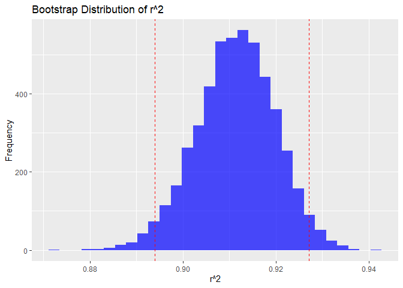

p8105_hw6_zz3308
================
Zitao Zhang
2024-11-24

# Problem 1

``` r
weather_df = 
  rnoaa::meteo_pull_monitors(
    c("USW00094728"),
    var = c("PRCP", "TMIN", "TMAX"), 
    date_min = "2017-01-01",
    date_max = "2017-12-31") %>%
  mutate(
    name = recode(id, USW00094728 = "CentralPark_NY"),
    tmin = tmin / 10,
    tmax = tmax / 10) %>%
  select(name, id, everything())
```

``` r
bootstrap_results <- weather_df %>%
  modelr::bootstrap(n = 5000) %>%
  mutate(
    models = map(strap, \(df) lm(tmax ~ tmin, data = df)),
    results = map(models, \(model) {
      r_squared <- glance(model) %>% pull(r.squared)
      coefficients <- tidy(model) %>% pull(estimate)
      log_beta_product <- log(coefficients[1] * coefficients[2])
      tibble(r_squared = r_squared, log_beta_product = log_beta_product)
    })
  ) %>%
  unnest(results)

ci_r_squared <- quantile(bootstrap_results$r_squared, c(0.025, 0.975))
ci_log_beta_product <- quantile(bootstrap_results$log_beta_product, c(0.025, 0.975))

cat("95% CI for r^2:", ci_r_squared, "\n")
```

    ## 95% CI for r^2: 0.893905 0.927649

``` r
cat("95% CI for log(β0 * β1):", ci_log_beta_product, "\n")
```

    ## 95% CI for log(β0 * β1): 1.965084 2.059414

``` r
ggplot(bootstrap_results, aes(x = r_squared)) +
  geom_histogram(bins = 30, fill = "blue", alpha = 0.7) +
  geom_vline(xintercept = ci_r_squared, color = "red", linetype = "dashed") +
  labs(
    title = "Bootstrap Distribution of r^2",
    x = "r^2",
    y = "Frequency"
  )
```

<!-- -->

``` r
ggplot(bootstrap_results, aes(x = log_beta_product)) +
  geom_histogram(bins = 30, fill = "green", alpha = 0.7) +
  geom_vline(xintercept = ci_log_beta_product, color = "red", linetype = "dashed") +
  labs(
    title = "Bootstrap Distribution of log(β0 * β1)",
    x = "log(β0 * β1)",
    y = "Frequency"
  )
```

<!-- -->

The blue histogram shows the bootstrap distribution of $r^2$, centered
around 0.91, with a 95% confidence interval from 0.89 to 0.93,
indicating strong model predictive power.

The green histogram shows the bootstrap distribution of
$log(\beta_0 \cdot \beta_1)$, centered around 2.00, with a 95%
confidence interval from 1.97 to 2.06, indicating consistency in the
coefficient relationship.

# Problem 2

``` r
url <- "https://github.com/washingtonpost/data-homicides/blob/master/homicide-data.csv?raw=true"
homicide_data <- read.csv(url) %>% janitor::clean_names()
```

``` r
homicide_data <- homicide_data %>%
  mutate(
    city_state = paste(city, state, sep = ", "),
    victim_age = ifelse(victim_age == "Unknown", NA, victim_age),
    victim_age = as.numeric(victim_age),
    resolved = disposition == "Closed by arrest"
  ) %>%
  filter(
    !(city_state %in% c("Dallas, TX", "Phoenix, AZ", "Kansas City, MO", "Tulsa, AL")), 
    victim_race %in% c("White", "Black"),
    !is.na(victim_age),
    !is.na(victim_race),
    !is.na(victim_sex)
  )
```

``` r
baltimore_data <- homicide_data %>% filter(city_state == "Baltimore, MD")

baltimore_model <- glm(
  resolved ~ victim_age + victim_sex + victim_race,
  data = baltimore_data,
  family = binomial
)

baltimore_results <- tidy(baltimore_model, exponentiate = TRUE, conf.int = TRUE) %>%
  filter(term == "victim_sexMale")

print(baltimore_results)
```

    ## # A tibble: 1 × 7
    ##   term           estimate std.error statistic  p.value conf.low conf.high
    ##   <chr>             <dbl>     <dbl>     <dbl>    <dbl>    <dbl>     <dbl>
    ## 1 victim_sexMale    0.426     0.138     -6.18 6.26e-10    0.324     0.558

``` r
city_results <- homicide_data %>%
  group_by(city_state) %>%
  nest() %>%
  mutate(
    models = map(data, ~ glm(
      resolved ~ victim_age + victim_sex + victim_race,
      data = .x,
      family = binomial
    )),
    results = map(models, ~ tidy(.x, exponentiate = TRUE, conf.int = TRUE))
  ) %>%
  unnest(results) %>%
  filter(term == "victim_sexMale") %>%
  select(city_state, estimate, conf.low, conf.high)

print(city_results)
```

    ## # A tibble: 47 × 4
    ## # Groups:   city_state [47]
    ##    city_state      estimate conf.low conf.high
    ##    <chr>              <dbl>    <dbl>     <dbl>
    ##  1 Albuquerque, NM    1.77     0.825     3.76 
    ##  2 Atlanta, GA        1.00     0.680     1.46 
    ##  3 Baltimore, MD      0.426    0.324     0.558
    ##  4 Baton Rouge, LA    0.381    0.204     0.684
    ##  5 Birmingham, AL     0.870    0.571     1.31 
    ##  6 Boston, MA         0.674    0.353     1.28 
    ##  7 Buffalo, NY        0.521    0.288     0.936
    ##  8 Charlotte, NC      0.884    0.551     1.39 
    ##  9 Chicago, IL        0.410    0.336     0.501
    ## 10 Cincinnati, OH     0.400    0.231     0.667
    ## # ℹ 37 more rows

``` r
ggplot(city_results, aes(x = reorder(city_state, estimate), y = estimate)) +
  geom_point(color = "blue") +
  geom_errorbar(aes(ymin = conf.low, ymax = conf.high), width = 0.2, color = "red") +
  coord_flip() +
  labs(
    title = "Adjusted Odds Ratios (Male vs Female Victims) for Resolved Homicides",
    x = "City",
    y = "Adjusted Odds Ratio (Male vs Female)"
  ) +
  theme(axis.text.y = element_text(size = 6))
```

<!-- -->

The plot illustrates the adjusted odds ratios (ORs) for resolving
homicides involving male versus female victims across cities, with
confidence intervals highlighting variability in the estimates. While
some cities show statistically significant differences (confidence
intervals entirely above or below 1), many have wide intervals
reflecting uncertainty, likely due to limited data. Cities with narrower
intervals, such as Baltimore, provide more reliable estimates, whereas
cities like Albuquerque indicate a need for further data review.
Overall, there is substantial heterogeneity across cities in the
resolution likelihood based on victim sex.

# Problem 3
